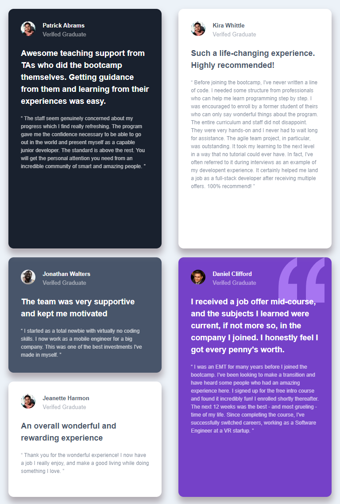

# Testimonial Grid Section Challenge

This project is a solution to the Testimonial Grid Section Challenge from Frontend Mentor. The challenge involved creating a responsive testimonial grid section with a modern design.

## Table of Contents

- [Overview](#overview)
  - [Screenshot](#screenshot)
  - [Links](#links)
- [Technologies Used](#technologies-used)
- [Features](#features)
- [Getting Started](#getting-started)
  - [Prerequisites](#prerequisites)
  - [Installation](#installation)
- [Usage](#usage)
- [Contributing](#contributing)
- [License](#license)
- [Acknowledgements](#acknowledgements)

## Overview

### Screenshot

|  |  |  |
| ------------------------------ | ----------------------------- | ----------------------------- |
| Desktop version                | Mobile version                | Tablet version                |

### Links

- [Live Demo](https://your-live-demo-link.com)
- [Frontend Mentor Challenge Page](https://www.frontendmentor.io/challenges/testimonial-grid-section-Nnw6J7Un7)

## Technologies Used

- Next.js
- Tailwind CSS

## Features

- Responsive testimonial grid section
- Modern design using Tailwind CSS

## Getting Started

### Prerequisites

- Node.js (version 16.14.2 or higher)

### Installation

1. Clone the repo
   ```sh
   git clone https://github.com/hatemhenchir/testimonials-grid-section.git
2. Install NPM packages
    ```sh
    npm  install
## Usage

1. Run the development server
    ```sh
    npm run dev
2. Open http://localhost:3000 with your browser to see the result.

## Contributing

Contributions are always welcome! If you have any ideas or suggestions on how to improve this project, please feel free to open an issue or submit a pull request.

## License

This project is licensed under the [MIT License](https://mit-license.org/).

## Acknowledgements

. [Frontend Mentor](https://www.frontendmentor.io/)

. [Next.js](https://nextjs.org/)

. [Tailwind CSS](https://tailwindcss.com/)